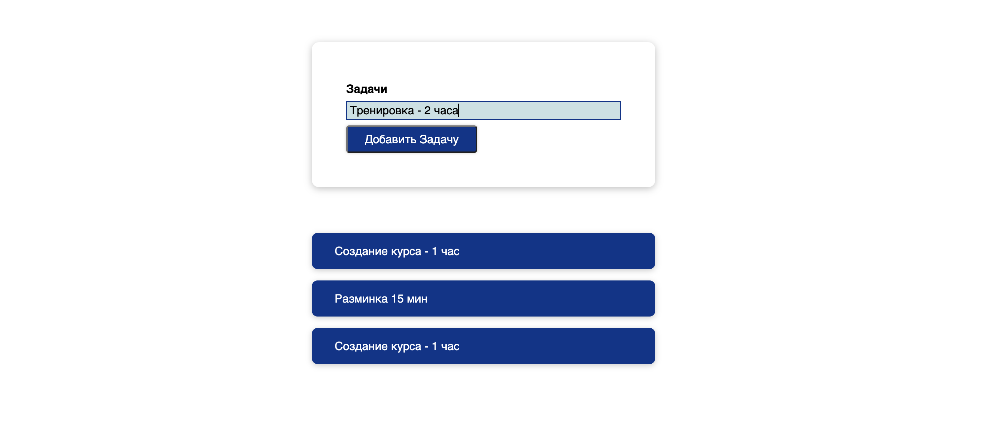

## Basic React application to manage tasks

### Very basic React application to manage tasks

Features:
- You can add tasks
- They appear in the task list
- You can remove them from the task list

To run application locally:
- run in terminal `npm install`
- run in terminal `nmp run start`
- open `localhost:3000` in your browser
- use it

To build application:
- run in terminal `npm run build`
- you'll have your build in `build` directory
- open `index.html` in your browser

#### Demo is here: [click me!](http://tasklist.surkoff.su)
